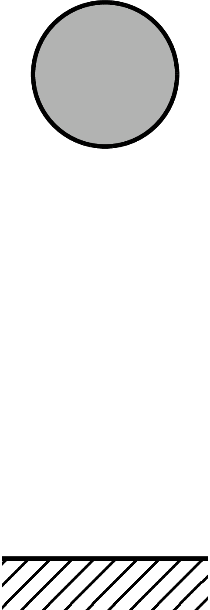

# TikZ2animation
After finishing writing a conference paper with beautiful [PGF/TikZ](https://tikz.dev/) plots, I constantly faced the same struggle: I basically needed to redo all the plots to obtain nice videos for my presentation.
Moreover, I really like the freedom TikZ gives me over my plots, and it is very easy to make consistent plots. Let's see whether we can use TikZ's great power to create beautiful animations without adapting the code of the paper's freeze frame too much.

The code in this repo somewhat solves that problem.
Let's assume I put a lot of time and effort into producing a picture of a bouncing ball for my conference paper. It might look somewhat like this:

Ideally, I would take the same code and create a video from it for my presentation!
To do that, you obviously have to add some time component to the mix. In this example of the bouncing ball, this might be the height of the ball above the ground as a function of time.
But apart from that, we can completely reuse the code!
After adding the height of the ball in dependence on time (in this case time is represented via \s) the final GIF will look like this:

I like GIFs because they are widely supported by PowerPoint, and you can add transparency to them, which looks particularly nice with presentation backgrounds that are not a solid colour.

## Workflow
>Note: This approach is based on the PGF/TikZ [externalize library](https://tikz.dev/library-external). Make sure you have the corresponding shellescape set correctly in your TeX editor! Moreover, the free [ImageMagick](https://imagemagick.org/index.php) software package for Linux. If you don't have one, you can use a similar tool. Read the "How does it work" section to replace the corresponding commands with your favourite software package to convert images and create animated GIFs.

1. make a beautiful TikZ picture
2. copy the preamble and the TikZ picture to tikz2animation.tex, the preamble goes where the preamble always goes (at the beginning of the tex file), and the code for the TikZ picture goes within the \foreach loop. Make sure to modify the picture so that it is dynamic somehow! The variable \iter counts up from 1 and marks the number of the frame. It can also be used to import external data if your animation is based on simulation data that was generated with some other software, for example:
\addplot[] table[] {external_data_\iter.csv};
You can also have multiple variables for more advanced aminations by adapting the corresponding [\foreach](https://tikz.dev/pgffor) command accordingly. Your imagination is the limit here!
3. build the PDF file
4. run the included bash script makeGif.sh

## How does it work?
After pasting your beautiful TikZ code, the externalize package will create each frame as a PDF in the frames directory.
After running the bash script, each frame is converted from a PDF to a PNG.
The PNGs are used to create the animated GIF.