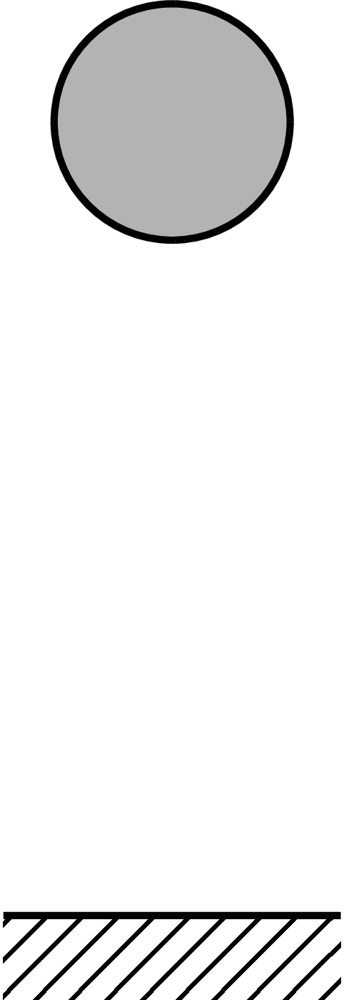
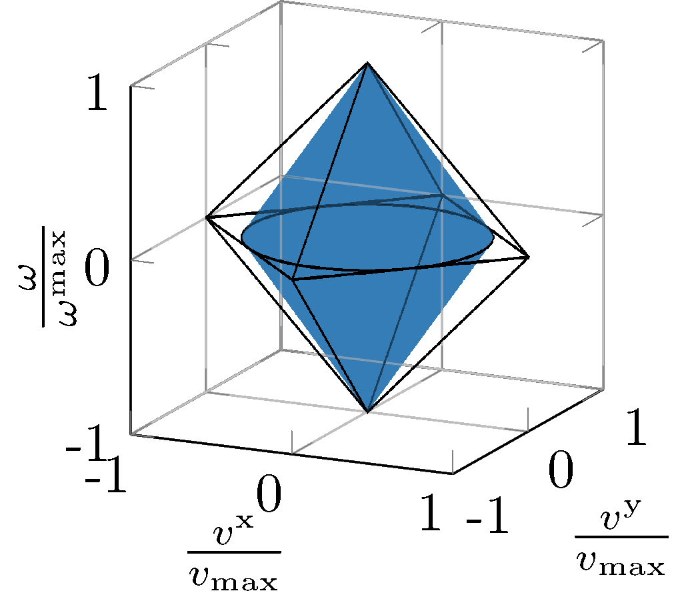
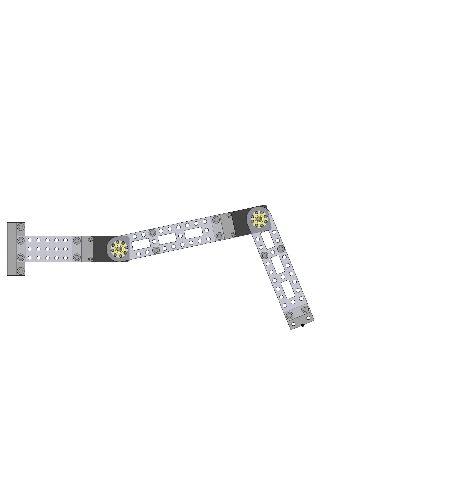
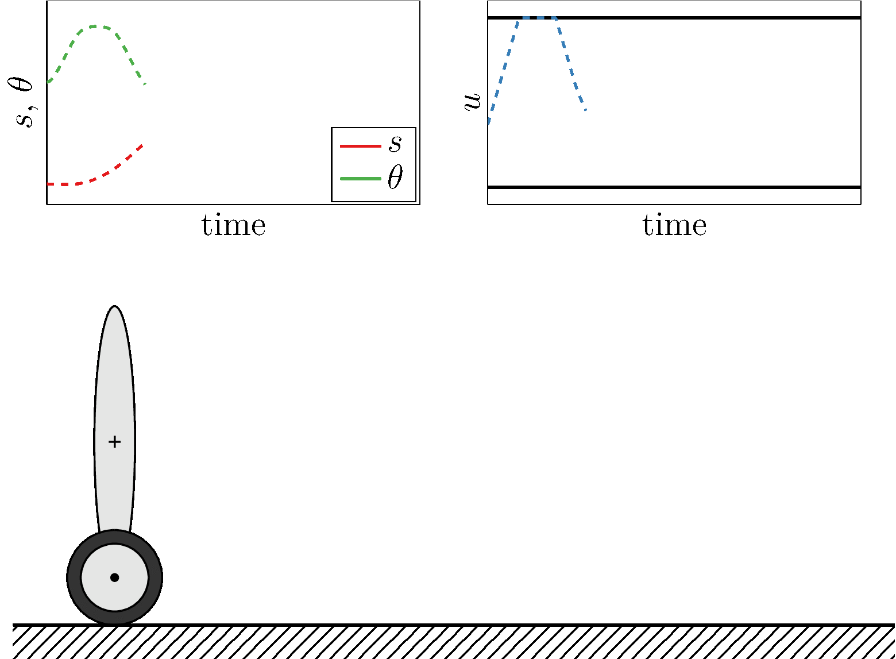
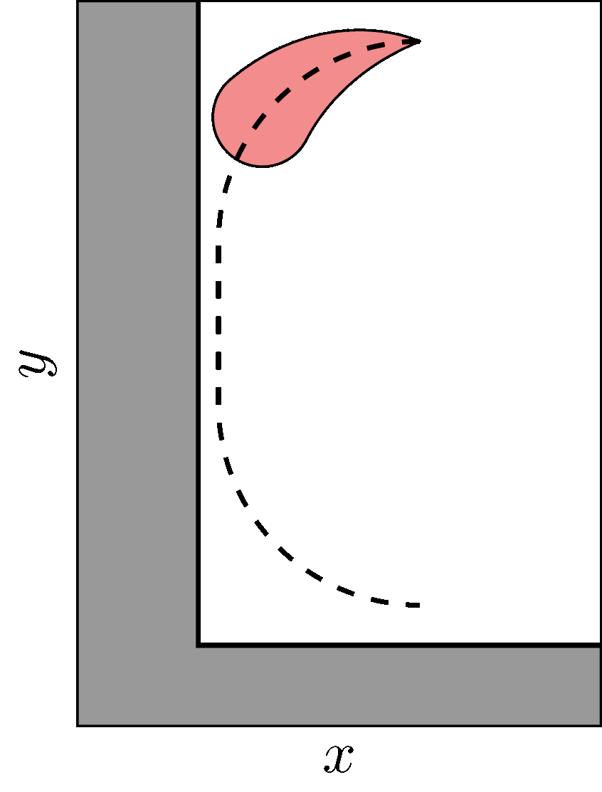

# TikZ2animation
After finishing writing a conference paper with beautiful [PGF/TikZ](https://tikz.dev/) plots, I constantly faced the same struggle: I basically needed to redo all the plots to obtain nice videos for my presentation.
Moreover, I really like the freedom TikZ gives me over my plots, and it is very easy to make consistent plots. Let's see whether we can use TikZ's great power to create beautiful animations without adapting the code of the paper's freeze frame too much.

The code in this repo somewhat solves that problem.
Let's assume I put a lot of time and effort into producing a picture of a bouncing ball for my conference paper. It might look somewhat like this:

Ideally, I would take the same code and create a video from it for my presentation!
To do that, you obviously have to add some time component to the mix. In this example of the bouncing ball, this might be the height of the ball above the ground as a function of time.
But apart from that, we can completely reuse the code!
After adding the height of the ball in dependence on time (in this case, time is represented via \s), the final GIF will look like this:

I like GIFs because they are widely supported by PowerPoint, and you can add transparency to them, which looks particularly nice with presentation backgrounds that are not a solid colour.

## Workflow
>Note: This approach is based on the PGF/TikZ [externalize library](https://tikz.dev/library-external). Make sure you have the corresponding shellescape set correctly in your TeX editor! Moreover, the free [ImageMagick](https://imagemagick.org/index.php) software package for Linux. If you don't have one, you can use a similar tool. Read the "How does it work" section to replace the corresponding commands with your favorite software package to convert images and create animated GIFs.

1. make a beautiful TikZ picture
2. copy the preamble and the TikZ picture to tikz2animation.tex, the preamble goes where the preamble always goes (at the beginning of the tex file), and the code for the TikZ picture goes within the \foreach loop. Make sure to modify the picture so that it is dynamic somehow! The variable \iter counts up from 1 and marks the number of the frame. It can also be used to import external data if your animation is based on simulation data that was generated with some other software, for example:
\addplot[] table[] {external_data_\iter.csv};
You can also have multiple variables for more advanced animations by adapting the corresponding [\foreach](https://tikz.dev/pgffor) command accordingly. Your imagination is the limit here!
3. build the PDF file
4. run the included bash script makeGif.sh

## How does it work?
After pasting your beautiful TikZ code, the externalize package will create each frame as a PDF in the frames directory.
After running the bash script, each frame is converted from a PDF to a PNG.
The PNGs are used to create the animated GIF.

## More Examples
Once you get more comfortable with this approach, you can get even fancier! These are some animations from my PhD defense that I'd like to share with you before they inevitably will get lost on my hard drive ;)

### Animating Pictures
Suppose you have a series of pictures (PDFs, PNGs, JPEGs, ...) that you want to add to your plots. Surface plots generated in an external software comes to mind, as Tikz is notoriously bad with 2D plots.
To achieve this and your pictures are named frame_1.png  to frame_40.png you could to something like:

    \foreach \iter in {1,...,40} {

        [...]

        \node[anchor=south west,inner xsep = 0, inner ysep = 0,opacity=1.0] (image) at (axis description cs:-0.001,-0.001){\includegraphics[width=\pgfkeysvalueof{/pgfplots/width},height = \pgfkeysvalueof{/pgfplots/height}]{frames/frame_\iter.png}};

        [...]

An example is shown below via the blue rotating set.

### Animating Multiple Shapes
To animate multiple shapes, say two angles alpha and beta you can do:

    \foreach \alpha/\beta [count=\iter] in {first_alpha/first_beta, [...], last_alpha/last_beta} {

        [...]

Obviously you have to insert the appropriate numbers for first_alpha/first_beta to last_alpha/last_beta here :)
An example is shown below via the moving two link manipulator.

### Animating Line Plots
To additionally animate a line from an external file data.txt within an PGF axis environment you can do

    \foreach \alpha/\beta [count=\iter,evaluate=\iter as \iiter using \iter*2-2] in {first_alpha/first_beta, [...], last_alpha/last_beta} {

        [...]

        \addplot[draw=red, select coords between index={0}{\iiter}] table[col sep = comma, x = x1, y = x2] {data.txt};

        [...]

Here the line is drawn with twice the speed, so you can have more data points than frames here. Make sure to set "[select coords between index](https://mylatexnotes.wordpress.com/2017/05/08/plots-how-to-select-first-n-rows-of-data-to-plot/)" somewhere.
An example is shown below on above the scooter animation. The scooter was animated as multiple shapes.

### Animating External Data
If you don't want to proceedingly draw the same line but different ones contained in data with header x1 y1 ... to x50 y50:

    \foreach \iter in {1,...,50} {

        [...]

		\addplot[draw=black, fill=red] table[col sep = comma, x = x\iter, y = y\iter] {data.txt}--cycle;

        [...]

Here the data represents boundary points of a closed shape, of course it can also be a line :)
Just make sure your data is labeled via the header, or alternatively select the data via the column number.
An example is shown below via the moving blob. The lines are animated as stated before.

Happy Animating!